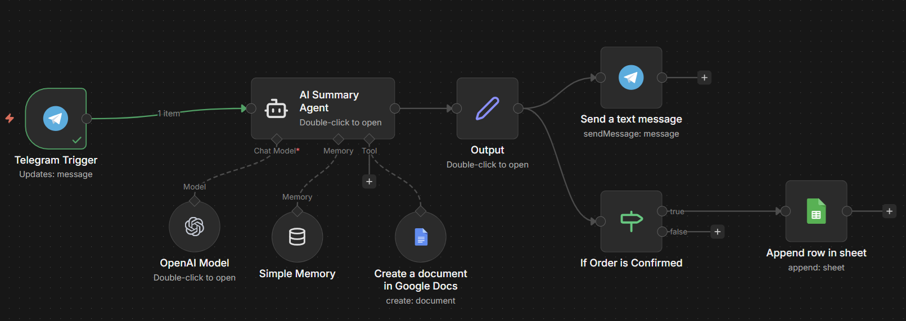

# AI-Powered Telegram Order Automation (n8n + LangChain)

This project demonstrates a **production-ready AI automation pipeline** built using **n8n** and **LLMs (via LangChain/OpenAI)** to handle **Telegram customer interactions**, provide **context-aware replies using business data**, and **automatically record completed orders** into Google Sheets.

The system is designed to reduce manual workload, ensure consistent responses, and maintain structured order records with minimal human intervention.

---

## ✅ Features

- 🤖 **AI-powered Telegram auto-reply system**
- 🧠 **Context-aware LLM responses** using business data stored in Google Docs
- 🔁 **n8n workflow orchestration** for end-to-end automation
- 📄 **Dynamic business knowledge retrieval** from Google Docs
- ✅ **Order completion detection**
- 📊 **Automatic order logging** in Google Sheets
- 🔐 Secure handling of credentials (no secrets in code)
- ♻️ Easily extendable and scalable workflow design

---

## 🧠 How It Works (High-Level Flow)

1. Customer sends a message on **Telegram**
2. **Telegram Trigger (n8n)** receives the message
3. **AI Agent** processes the message using:
   - LLM (OpenAI / Gemini / other)
   - Business context from Google Docs
4. AI sends a **human-like, context-aware reply** back to Telegram
5. If an **order confirmation** is detected:
   - Customer details and order information are extracted
   - Data is **automatically appended** to Google Sheets

---

## 🏗️ Architecture Overview



---

## 🛠️ Tech Stack

- **n8n** – Workflow automation & orchestration
- **LangChain** – LLM agent & context engineering
- **OpenAI / LLM** – Natural language understanding & response
- **Telegram Bot API** – Customer interaction channel
- **Google Docs API** – Business knowledge base
- **Google Sheets API** – Order data storage
- **Python / JavaScript** – Custom logic (via n8n Code nodes)

---

## 📂 Project Structure

telegram-ai-order-automation/
│
├── n8n/
│   └── workflow.json
│
├── langchain/
│   ├── agent.py
│   └── prompt_templates.py
│
├── docs/
│   ├── architecture.png
│   ├── data-flow.png
│   ├── google-doc-structure.md
│   └── google-sheet-schema.md
│
├── requirements.txt
├── .env.example
└── README.md

---

## 🚀 Getting Started

### 1️⃣ Import Workflow into n8n

1. Open **n8n Editor**
2. Click **Import from File**
3. Select:

```
n8n/workflow.json
```

---

### 2️⃣ Setup Environment Variables

Create a `.env` file based on the example:

```env
OPENAI_API_KEY=your_openai_api_key
TELEGRAM_BOT_TOKEN=your_telegram_bot_token
GOOGLE_SERVICE_ACCOUNT_JSON=path_to_service_account.json
```

⚠️ **Never commit your real secrets to GitHub**

---

### 3️⃣ Configure n8n Credentials

In n8n:

* Add **Telegram API** credentials
* Add **Google Docs** credentials
* Add **Google Sheets** credentials
* Add **OpenAI / LLM** credentials

---

## 📊 Google Sheets Schema (Example)

```text
| Order ID | Customer Name | Telegram Username | Product | Quantity | Price | Timestamp |
```

---

## 📄 Google Docs (Business Knowledge)

The Google Doc acts as a **single source of truth** for:

* Product descriptions
* Pricing
* Delivery policies
* Refund rules
* FAQs

This document is dynamically referenced by the AI agent to generate accurate replies.

---

## 🧪 Example Use Case

Customer message:

> "I want to order 2 units of Product A. Is delivery available?"

AI response:

> "Yes, delivery is available. Your order for 2 units of Product A has been confirmed."

Order data is automatically recorded in **Google Sheets**.

---

## 🔄 Scalability & Improvements

* Plug in **vector databases** (Pinecone, Weaviate, FAISS) for RAG
* Add **order status tracking**
* Multi-language support
* CRM integration
* Analytics & monitoring for AI responses

---

## ⚠️ Notes

* Workflow JSON does **not** include credentials
* Google APIs require proper service account setup
* Ensure n8n has internet access for Telegram & LLM APIs

---

## 👨‍💻 Author

Created by **ar_titumir**
GitHub: [https://github.com/ar-titumir](https://github.com/ar-titumir)

If this project helps you, please ⭐ the repository.

---

## 📌 License

This project is for educational and demonstration purposes.
Feel free to fork and extend it for your own automation needs.

```
```
